# ASUS router icons

An assortment of extra ASUS router icons.

You can either checkout this repository or individually download icons below.

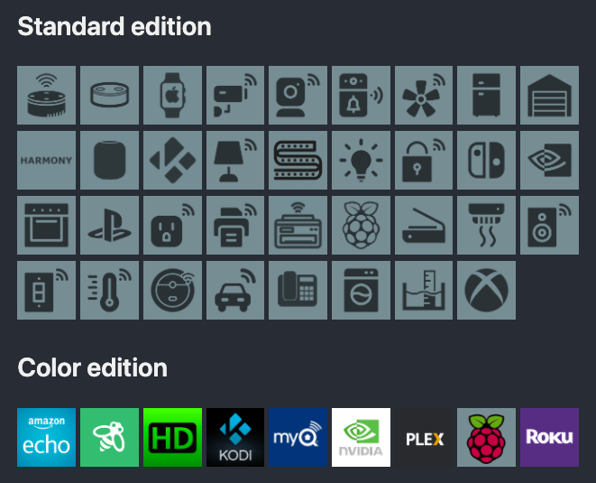

## Standard edition

| Name | Icon |
|------|------|
| amazon_echo_dot-2 | 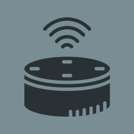 |
| amazon_echo_dot-3 |  |
| amazon_echo |  |
| amazon_fire |  |
| apple_watch | 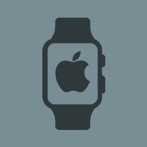 |
| cctv-1 |  |
| cctv-2 | 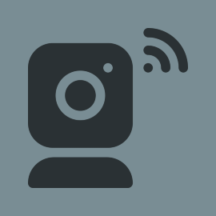 |
| cctv-3 |  |
| doorbell | 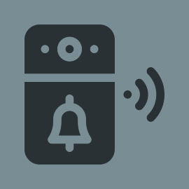 |
| fan |  |
| fridge | 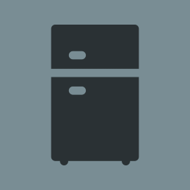 |
| garage | 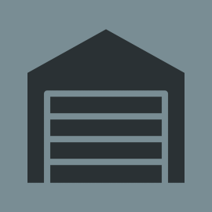 |
| harmony |  |
| homepod |  |
| kodi |  |
| lamp | 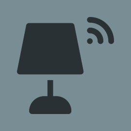 |
| led_strip |  |
| light_bulb |  |
| lock |  |
| nintendo_switch | 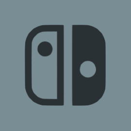 |
| nvidia |  |
| oven |  |
| playstation |  |
| plug | 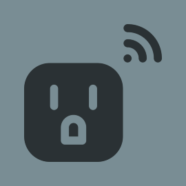 |
| printer | 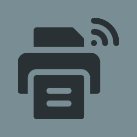 |
| raspberry_pi | 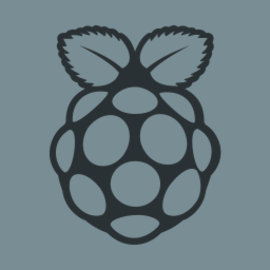 |
| roku |  |
| scale | 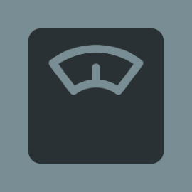 |
| scanner |  |
| smoke_detector | 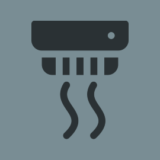 |
| speaker | 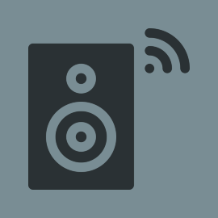 |
| stick |  |
| switch |  |
| thermostat | 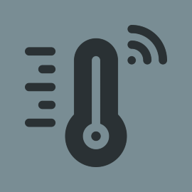 |
| vacuum_robot |  |
| vehicle |  |
| voip |  |
| washing_machine |  |
| water_sensor | 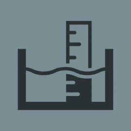 |
| xbox |  |

## Color edition

| Name | Icon |
|------|------|
| amazon_echo-color |  |
| ecobee-color |  |
| hdhomerun-color |  |
| kodi-color |  |
| myq-color |  |
| nvidia-color |  |
| plex-color |  |
| raspberry_pi-color |  |
| roku-color |  |

## Creating a new icon

If you don't have Photoshop or similar, try using https://pixlr.com/x/ which is free.

- Create a canvas size of `270x270`
- Create a bottom layer and apply a solid background color of `#798D94`
- Create or download icons, check out https://iconscout.com or https://flaticon.com
- Paste in any black `#000000` icon with a transparent background as a second top layer
- Transform the top icon layer to a size of about `200x200`
- Center the top icon layer
- Lower opacity of the icon layer to `65`
- Save the icon as a `png`, or alternatively `jpg` if it's much smaller filesize
